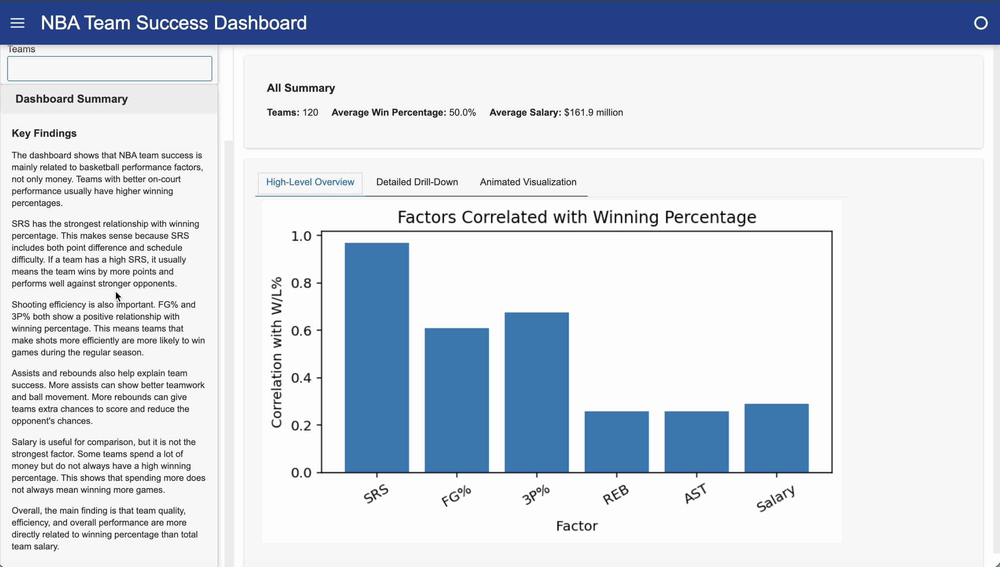

# NBA Team Success Dashboard

An interactive dashboard developed to analyze NBA team performance and winning percentage.

## Project Overview

This project uses Python, Pandas, and Matplotlib to analyze NBA team data and explore relationships between winning percentage and different performance factors.

The dashboard includes charts, animations, and brief descriptions to help users understand team performance and compare NBA teams.

## Features

- Interactive data visualizations
- NBA team comparisons
- Winning percentage analysis
- Performance factor analysis
- Charts and animations
- Brief explanations of key findings

## Tools and Skills

- Python
- Pandas
- Matplotlib
- Data Analysis
- Data Visualization
- Data Cleaning
- Dashboard Development

## Demo

[Watch the NBA Team Success Dashboard Demo](https://drive.google.com/file/d/1JxmifwLaiRyngCbHYwqdNu0ANIS0yL_r/view?usp=sharing)

Demo video showing the dashboard interface, interactive filters, charts, and animated visualizations.

## Dashboard Preview

.png)

.png)

